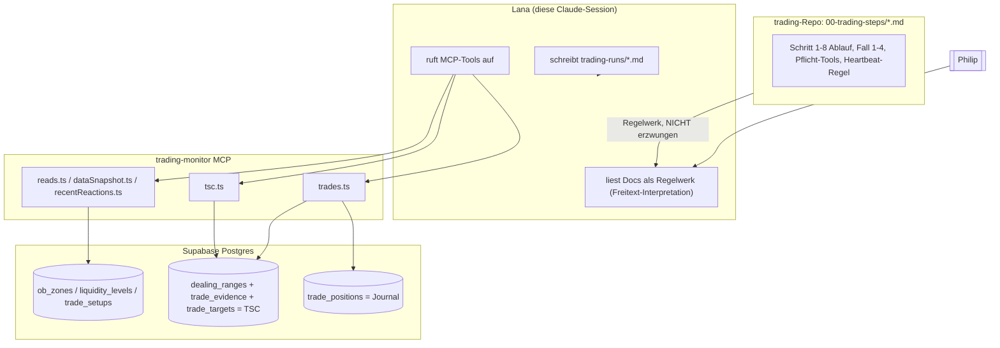

# State Machine für Lanas Trading-Ablauf (Schritt 1-6 mechanisieren)

Status: Refinement-Phase, Design steht, noch kein Code. milk-city: Feature `state-machine`, Task
`state-machine-v1`.

## State-Machine V2 (05.09.2026): echter Entscheidungsbaum statt current_step/current_case

Auslöser: `run_dealing_range_loop` mit `replayUntilSec` gleich dem letzten Analysezeitpunkt lief in
einen stillen No-op statt in die dafür gebaute "erster Tick"-Logik — `current_step`/`current_case`
kannten keinen echten Zustand, nur eine Zahl. Philip: die Maschine soll exakt den Baum aus beiden
Diagrammen abbilden (jeder Knoten aus `diagrams/trading-steps-ablauf.html` +
`diagrams/dealing-range-loop.html` ein echter State), live in der UI sichtbar.

Umgesetzt mit **XState v5** (`supabase/functions/trading-monitor-mcp/tradingMachine.ts`) — pro
Tool-Aufruf wird der Actor aus `trading_loop_state.machine_snapshot` rehydriert
(`getPersistedSnapshot()`/`createActor(machine, { snapshot })`, XStates eigenes Muster für
"State lebt in der DB, nicht im Prozess"), bekommt ein Event, wird sofort wieder persistiert
(`machineState.ts`). `sendGuarded()` blockt hart bei einem am aktuellen Knoten ungültigen Event
(sprechende Fehlermeldung statt stillem No-op) — die eigentliche Bug-Behebung.

- `current_step`/`current_case` bleiben bestehen (aus dem Knoten abgeleitet), jetzt bis Schritt 8
  (`trading_loop_state_current_step_check` entsprechend erweitert), fürs bestehende
  `LoopStatus.vue`.
- Fall 3 (`hasReaction=false`) und Fall 4 (Preisvergleich) klassifiziert `run_dealing_range_loop`
  jetzt automatisch — nur Fall 1 vs. 2 bleibt Lanas Urteil (`log_fall_classification`-Tool, Pendant
  zu `log_bias_decision`).
- `TradingFlow.vue` (Route `/trading-flow`) rendert den kompletten Baum live als Mermaid-Graph
  (`src/tradingMachineGraph.js`, Hand-Duplikat der Knoten/Kanten — keine Shared-Build zwischen
  Frontend/Deno-Edge-Function, siehe "Zwei Runtimes" in CLAUDE.md), aktueller Knoten hervorgehoben.
- **Bewusst noch nicht verdrahtet:** Schritt 5s TSC-Verknüpfungs-Kette (`tscGet`/`tscExists`/
  `tscBootstrap`/`tscAdd`/`pinCheck`/`findTargets`/`llmPickTarget`/`addTarget`) sowie Schritt 6-8 —
  diese States existieren bereits vollständig in der Maschine (siehe `test/tradingMachine.test.js`),
  sind aber noch nicht an `add_trade_confirmation`/`add_trade_target`/`remove_pin_entry`/
  `get_validation_evidence` angebunden. Diese Tools werden auch für Trade-Journal-Aktionen abseits
  des Schritt-5-Loops genutzt — hartes Transition-Blocking dort verdient eigene, sorgfältige
  Tests, bevor es scharf geschaltet wird.

## Diagramme

- [Trading-Steps-Ablauf](diagrams/trading-steps-ablauf.html) — kompletter Schritt-1-8-Zyklus,
  News-Pause-Wecker, die zwei dauerhaften LLM-Stellen (Schritt 3 Kontext-Info-Synthese, Schritt 6
  VALIDE/INVALIDE-Abwägung).
- [Dealing-Range-Loop](diagrams/dealing-range-loop.html) — Detail zu Schritt 4/5: Live-Tick vs.
  Backtest-Fast-Forward, TSC-Verknüpfung inkl. Pin-Aufräum-Pflicht (`remove_pin_entry`), und wo
  Ziel-/Anti-Confluence-Auswahl heute noch aus einer Tool-Kandidatenliste per Lana statt
  automatisch passiert.

  Beide als eigenständige HTML-Dateien im Repo (nicht nur als externe Claude-Artefakte) — lokal im
  Browser öffnen oder per Live-Server-Extension in VS Code.

## Problem

Backtest GBPUSD 28.08.2026 (Fortsetzung ab 16:00): Nach dem ersten Fall-4-Trigger (News-Spike, altes
Trend-Target gebrochen) ist Lana aus dem dokumentierten Schritt-5-Ablauf ausgestiegen und hat frei
weiteranalysiert. Folge: die Pflicht-Tools (`get_data_snapshot`/`get_recent_reactions`) liefen nach
16:00 kein zweites Mal, ein bereits app-erkanntes Short-Setup (#470) sowie mehrere LQ-Sweeps wurden
übersehen, ein OB wurde falsch gelabelt (bärisch statt bullisch benannt), ein Zwischen-Level wurde
übersehen, und über eine Stunde Backtest-Vorspulen kam kein einziger Heartbeat — obwohl die
Heartbeat-Pflicht in `05-dealing-range-bestaetigen.md` (trading-Repo) fett dokumentiert ist. Reine
Doku hat den Ausrutscher nicht verhindert, weil nichts zwischen Lana und den MCP-Tool-Aufrufen die
Docs-Regeln mechanisch durchsetzt.

**Ziel (Philip):** "Alles was in trading-steps per Programmcode abgenommen werden kann, wird
abgenommen. Lana ist nur noch für Sachen zuständig, die nur ein LLM kann." Scope: Schritt 1 bis
inkl. Schritt 6. Laufzeit-Ort: neue `trading-monitor`-MCP-Tools, weiterhin von Lana aufgerufen (kein
separater Cron-Dienst wie `poi-watcher`).

Was **dauerhaft bei Lana bleibt** (freie Synthese, keine Kandidatenliste zum Wählen):
- Schritt 3: freie "Kontext-Info"-Synthese (zwei Beobachtungen zu einer Einordnung verknüpfen); die
  Bestimmung des 1H-Trends selbst, sobald `structure1h.trend` unbestätigt (`"unknown"`) zurückkommt
  — reine manuelle Kraft-Abwägung, siehe [Fall 5](../00-trading-steps/03-htf-bias/03-htf-bias.md#ergebnis).
  Philip, 31.08.2026: "das mit dem Trend überlassen wir erst mal Lana, das ist etwas seeeehr
  Schweres, was ich selbst nicht mal gut hinbekomme" — `run_bias_check` liefert in diesem Fall
  bewusst nur `unresolvedTrend: true`, KEINEN `trading_loop_state`-Write.
- Schritt 5: die komplette Fall-1/2/3-Einordnung selbst — auch die scheinbar mechanischen Teile
  ("OB hält" via `touched`/`invalidated`, "valider Sweep" vs. bloßer Strukturbruch). Philip,
  31.08.2026, zur ersten Version dieser Datei (die genau das automatisch klassifiziert UND bei
  vermutetem Fall 1 automatisch `add_trade_confirmation`/`add_trade_target`/Pin-Aufräumen ausgelöst
  hatte): "eig sind alle drei Punkte LLM Sache" (bezogen auf alle drei Situationen unter "Fall 1 —
  Dealing Range existiert", nicht nur "Markt bewegt sich sauber im Trend"). `run_dealing_range_loop`
  liefert deshalb nur noch rohe Evidenz (Setups/Sweeps/OB-Reaktionen) + einen reinen
  Existenz-Flag (`hasReaction`, ohne Bewertung) — NUR Fall 4 (reiner Preisvergleich gegen Target/
  Invalidierung) wird mechanisch entschieden. Die TSC-Verknüpfung bei einem von Lana erkannten
  Fall 1 (Bootstrap/Bestätigung/Target/Pin-Aufräumen) läuft weiterhin über Lanas eigene
  `add_trade_confirmation`/`add_trade_target`/`remove_pin_entry`-Aufrufe, nicht automatisch.
- Schritt 6: die finale VALIDE/INVALIDE-Abwägung (qualitativ laut Doku, kein Schwellenwert).
- Kommunikation mit Philip, `CronCreate`/`CronDelete`/`PushNotification` (Claude-Code-Primitive,
  nicht aus einer Edge Function auslösbar).

Was **heute noch bei Lana liegt, aber Kandidat für eine spätere Mechanisierung ist** (Tool liefert
bereits eine Kandidatenliste, Lana wählt nur noch daraus — siehe Dealing-Range-Loop-Diagramm):
- Schritt 5: Ziel-Auswahl aus `find_targets`s Kandidatenliste vor `add_trade_target`.
- Schritt 6: welche `find_anti_confluences`-Kandidaten tatsächlich als Confluence/Anti-Confluence
  zählen, vor `add_trade_confirmation`.

## Reporting: `trading-runs/*.md` verliert seinen Zweck

Sobald `trading_loop_state` + die TSC-Tabellen (`dealing_ranges`/`trade_evidence`/`trade_targets`)
den mechanischen Teil sauber und live-aktuell halten, verliert `trading-runs/[Instrument]/[Datum]/
*.md` (handgeschriebenes Markdown pro Schritt-Durchlauf, siehe `00-trading-steps.md`) fast seinen
ganzen Sinn — eine UI, die direkt aus diesen Tabellen rendert, ist strikt besser: immer aktuell,
kein Drift zwischen "was passiert ist" und "was Lana aufgeschrieben hat", durchsuchbar/filterbar
statt Datei-für-Datei-Archäologie.

**Voraussetzung dafür, damit dabei nichts verloren geht:** Lanas freie Texte (Kontext-Info-
Synthese aus Schritt 3, die VALIDE/INVALIDE-Begründung aus Schritt 6) brauchen ein strukturiertes
Zuhause in der DB, sonst verschwinden genau die Stellen, die den meisten Kontext liefern, sobald
die `.md`-Dateien wegfallen. Konkret: neue `reasoning`/`synthesis`-Textspalte an `dealing_ranges`
(analog zum bereits vorhandenen `trade_positions.reasoning`) — Lana schreibt ihre Schritt-3/6-
Einordnung dort hinein statt (nur) in die Markdown-Datei. Gehört als Migration in denselben Zuschnitt
wie `trading_loop_state` (siehe unten), nicht als separater Nacharbeits-Punkt.

**Entschieden (Philip, 31.08.2026): ja, UI nötig** — "ich muss ja auch was sehen, will keine
Datenbanken durchforsten". Eigener Task `state-machine-v1-ui` (Feature `state-machine`), zeitlich
NACH `state-machine-v1` (reine Lese-UI, hängt an den Tabellen, nicht an den Tools selbst — kann
aber grob parallel entworfen werden, sobald das Schema aus `state-machine-v1` steht).

**Kleinerer Umfang als "neues Dashboard" vermuten lässt** — TSC (`dealing_ranges`+`trade_evidence`+
`trade_targets`) und Journal (`trade_positions`) haben bereits eigene Ansichten
(`TradeSetupCockpit.vue`/`TradesTable.vue`, siehe `CLAUDE.md`) — die werden wiederverwendet, nicht
neu gebaut. Echter Neubau ist nur ein **Loop-Status-Panel** für `trading_loop_state`, das bisher
gar keine UI hat:
- aktiver Loop je Instrument: Status, aktueller Schritt/Fall, Watch-Level oben/unten,
  Trend-/Countertrend-Target, Invalidierung.
- `heartbeat_log` als Liste/Timeline (löst direkt "ich will keine DB durchforsten" — genau das,
  was heute nur im Chat vorbeirauscht, wird sichtbar/nachschlagbar).
- Historie: vorherige (`fall1_handoff`/`fall4_pending_bias`/`completed`) Loop-Zeilen je Tag, als
  Ersatz für das Durchklicken der `trading-runs/*.md`-Dateien.

Platzierung im bestehenden Dashboard noch offen (eigener Tab vs. Erweiterung von
`TradeSetupCockpit.vue`) — Teil der Umsetzung von `state-machine-v1-ui`, nicht hier vorentschieden.

## Ist-Architektur (zum Verständnis, keine Änderung)

**Kernproblem:** zwischen `Lana` und den Tool-Aufrufen sitzt nichts, das erzwingt, dass die Fall-
1-4-Logik, Pflicht-Tool-Reihenfolge und Heartbeats tatsächlich laufen — genau das hat heute
versagt.

## Soll-Architektur: 5 neue MCP-Tools + persistenter Loop-State

**Tool-Schnitt (statt eines Mega-Tools):** 5 fokussierte, komponierbare Tools nach demselben Muster
wie die bestehenden `find_targets`/`find_anti_confluences`/`get_data_snapshot`/`get_recent_reactions`
(je ein Zweck, klar typisiertes Schema, testbare Pure-Function-Kerne). Ein Mega-Tool würde ein
Zod-Schema für 5 strukturell verschiedene Payloads künstlich flach halten, Testbarkeit senken, und
Lana könnte nicht mehr gezielt nur "Schritt 4 jetzt" aufrufen (z.B. bei Replay-Einstieg mitten am
Tag ohne vorherigen Bias-Lauf).

1. **`check_pretrade_gates`** (Schritt 1+2) — Handelszeit + News-Ausschlusskriterium, kein State-Write.
2. **`run_bias_check`** (Schritt 3) — ruft Tool 1 intern zuerst, schreibt/erneuert `trading_loop_state`.
3. **`check_session_window`** (Schritt 4) — reine Fakten, kein State-Write, auch intern von Tool 4 genutzt.
4. **`run_dealing_range_loop`** (Schritt 5, Kernstück) — Fall-1/2/3/4-Klassifikation, TSC-Verknüpfung,
   im Backtest internes Batch-Fast-Forward inkl. vollständigem Heartbeat-Log.
5. **`get_validation_evidence`** (Schritt 6) — strukturiertes Confluence/Anti-Confluence-Paket + Score,
   OHNE die finale VALIDE/INVALIDE-Entscheidung selbst zu treffen.

### Persistenter Loop-State: neue Tabelle `trading_loop_state` + `dealing_ranges.reasoning`

Migration `supabase/migrations/20260831150000_trading_loop_state.sql` (Zeitstempel beim
tatsächlichen Anlegen gegen `Glob supabase/migrations/*.sql` prüfen, nicht blind übernehmen — kann
zwischen Planung und Umsetzung veraltet sein) — legt `trading_loop_state`
an UND ergänzt `dealing_ranges` um eine `reasoning`-Textspalte (analog `trade_positions.reasoning`,
siehe [Reporting](#reporting-trading-runsmd-verliert-seinen-zweck) oben) für Lanas Schritt-3/6-
Freitext-Synthese:

- `instrument`, `date_str`, `direction` (`long`/`short`, aus Schritt 3), `status`
  (`active`/`fall4_pending_bias`/`stopped_market_close`/`stopped_news_pause`/`superseded`/
  `completed` — `fall1_handoff` bleibt als Enum-Wert bestehen, wird aber seit der Korrektur
  31.08.2026 nicht mehr automatisch gesetzt, siehe Tool 4 unten), `current_step` (3/4/5),
  `current_case` (nur `4`, nullable — Fall 1/2/3 werden nicht mehr mechanisch geschrieben),
  `dealing_range_id` (FK, aktuell nirgends automatisch gesetzt — Lana verknüpft die TSC-Range
  weiterhin selbst, Feld bleibt für eine mögliche spätere manuelle/Tool-Verknüpfung reserviert),
  `trend_target`/`countertrend_target`/`intermediate_level` (jsonb: price/kind/refId/timeframe),
  `invalidation`, `watch_level_above`/`watch_level_below` (jsonb), `bias_computed_at`,
  `last_analysis_time_sec`, `replay_until_sec` (null = live), `heartbeat_log` (jsonb-Array,
  append-only), Timestamps. Partial-Unique-Index: nur EIN `active`-Loop pro Instrument — ein
  Fall-1-Abschluss oder Fall-4-Trigger beendet den Loop (`status` wechselt), ein neuer
  `run_bias_check`-Aufruf legt eine NEUE Zeile an (spiegelt die bestehende "mehrere DRs pro Tag,
  jede mit eigener Kennung"-Regel).
- `heartbeat_log` liegt bewusst SERVERSEITIG in der Tabelle, nicht nur in der Tool-Response — genau
  das schließt die Lücke aus dem Vorfall: selbst wenn Lana eine Antwort nicht vollständig weiterreicht,
  steht das Log fest und ist über einen Folge-Call (auch neue Chat-Session) abrufbar.
- Neue Datei `loopState.ts` (dünne Query-Helfer, Stil wie `db.ts`): `getActiveLoopState`,
  `upsertLoopState`, `appendHeartbeat`, `closeLoopState`.

### Tool 1 — `check_pretrade_gates` (Schritt 1+2)

Neue Datei `tools/pretradeGates.ts` + Pure-Logik `pretradeGates.ts` (dependency-frei, testbar):
- `evaluateTradingHoursGate`: **Quelle = `trading_schedules.trading_windows`** (Philips Entscheidung
  — aktiviert diese Spalte erstmals als echtes Gate statt nur Anzeige). Aktuell GBPUSD/EURUSD
  `weekday: [[480,1080]]` = 08:00–18:00. **Folgeaufgaben, die dadurch entstehen** (separat, anderes
  Repo/Dateien, hier nur benannt):
  - `trading/00-trading-steps/01-check-handelszeit/01-check-handelszeit.md` von 07:00–18:00 auf
    08:00–18:00 korrigieren.
  - `CLAUDE.md` (dieses Repo) Zeile zu `trading_windows` ("currently reference/display-only, ...
    not yet gating anything in code") aktualisieren, sobald dieses Tool live ist.
- `evaluateNewsGate`: bildet die Timing-Regeln aus `02-check-news.md` 1:1 ab (kurzfristig
  bevorstehend → aussetzen, NY-Zeit-News → reduzierte Erwartungshaltung vor NY-Open, bereits
  eingetreten → feste 15-30 Min Pause), inkl. der vorgegebenen Textbausteine als Rückgabefelder.

### Tool 2 — `run_bias_check` (Schritt 3)

Neue Pure-Logik-Datei `biasEngine.ts`, **importiert bestehende, bereits korrekte Bausteine statt sie
neu zu erfinden**: `findNearestLiquidityTargets`/`findNearestObTargets`/`buildCandidatePool` aus
`findTargetCandidates.js` (diese Funktionen waren NICHT der Bug vom 31.08. — die
Richtungskonvention "Short-Target = bullischer OB, Long-Target = bärischer OB" ist dort bereits
korrekt implementiert; der Fehler war Lanas eigene Fehlbeschriftung beim Formulieren, kein
Code-Bug).

- `determineTrendForce(...)`: Prüfpunkt (4) aus `03-htf-bias.md` — hält das relevante gegenläufige
  HTF-OB/-Level oder ist es sauber durchbrochen, rein aus `touched`/`invalidated` ableitbar. Setzt
  `belegOb.direction` direkt aus der DB-Zeile in den Textbaustein ein — die Fehlerklasse vom 31.08.
  (OB fälschlich als "bullisch" benannt) wird dadurch strukturell ausgeschlossen.
- `findIntermediateLevel(...)`: **die konkrete Lückenbehebung von heute.** Bisher wurde nur
  `asiaSession.rangeHigh/rangeLow` geprüft. Neue Funktion scannt zusätzlich den `candidatePool` nach
  gleichgerichteten OBs/Leveln zwischen aktuellem Kurs und Trend-Target (genau der heute übersehene
  Fall — Pin #236).
- `computeTrendCountertrendTargets(...)`: dünner Wrapper um die bestehenden Find-Funktionen, plus
  Spread-Hour-Pivot-Skip-Filter (`isSpreadHourPivot`, neu in `biasEngine.ts`, nicht in
  `findTargetCandidates.js` selbst — bleibt für `find_targets`/TSC unverändert wiederverwendbar).

Tool-Handler `tools/biasCheck.ts`: ruft Gate-Logik intern zuerst (Pure-Function-Import, kein
HTTP-Selbstaufruf), bricht bei Blockade sofort ab. Sonst: `structure1h` (Wiederverwendung der
`dataExport.ts`-Bausteine), die drei Pure-Functions, schreibt `trading_loop_state`
(`current_step=4`, Targets, Invalidierung, Zwischen-Level). Response enthält die Textbausteine aus
`03-htf-bias.md` bereits fertig vorformuliert, PLUS zwei explizit als `null` markierte Felder für
die zwei tatsächlich LLM-only Anteile (`kontextInfoSynthesis`, `paceCheckNote`) — macht sichtbar,
was mechanisch fertig ist und was Lana beisteuern muss.

### Tool 3 — `check_session_window` (Schritt 4)

Neue Datei `tools/sessionWindow.ts`, Pure-Logik direkt darin (trivial). Nutzt bestehendes
`getSessions()` + Berlin-Zeit. Reine Fakten (kein `--->`, keine Bewertung): aktive/unmittelbar
bevorstehende Asia/Spread-Hour/MMM/NY-Open-Fenster, alles andere weggelassen. Kein State-Write —
wird von Tool 4 bei jedem vollen Durchlauf intern erneut aufgerufen.

### Tool 4 — `run_dealing_range_loop` (Schritt 5, Kernstück)

**Korrigiert 31.08.2026** (Philip, zur ersten Version dieser Datei, die Fall 1/2/3 automatisch aus
`touched`/`invalidated`-Flags klassifiziert UND bei vermutetem Fall 1 automatisch TSC-Bootstrap +
`add_trade_confirmation`/`add_trade_target`/Pin-Aufräumen ausgelöst hatte): "eig sind alle drei
Punkte LLM Sache" (bezogen auf alle drei Situationen unter "Fall 1 — Dealing Range existiert" in
05-dealing-range-bestaetigen.md, nicht nur "Markt bewegt sich sauber im Trend") — auch "OB hält"
(`touched`/`invalidated`) und "valider Sweep vs. bloßer Strukturbruch" sind keine reine Preis-/
Flag-Ablesung, sondern eine Einordnung, die Lana trifft. Siehe [Was dauerhaft bei Lana
bleibt](#problem) oben für die volle Begründung.

Neue Pure-Logik-Datei `fallClassifier.ts`:
- `checkFallFour(...)`: rein mechanischer Preisvergleich (Trend-/Countertrend-Target oder
  Invalidierung erreicht) — die EINZIGE Fall-Klassifikation, die dieses Tool tatsächlich trifft.
- `hasReaction(...)`: reine Existenz-Prüfung (liegt IRGENDEIN vollständiges Setup/eine OB-Reaktion/
  ein Sweep vor?), KEINE Bewertung der Qualität — nur für Benachrichtigungspflicht (Fall 1+2, nicht
  unterschieden) und Backtest-Abbruchregel.
- `computeWatchLevels(...)`: der schlanke Loop-Tick-Preisvergleich aus der Doku.

Tool-Handler `tools/dealingRangeLoop.ts`:
- **Live** (kein `replayUntilSec`): ein Tick. Ruft `check_session_window` + die bestehenden
  `get_data_snapshot`/`get_recent_reactions`-Bausteine **fest verdrahtet statt optional** (genau die
  beiden Pflicht-Calls, die am 31.08. nach 16:00 nicht mehr liefen). Response liefert `fallFour`
  (hit/reason), `hasReaction` (bool), `evidence` (rohes Setup/OB-Reaktionen/Sweeps, ungefiltert nach
  "Fall") und `mustNotifyPhilip: hasReaction`. Bei `fallFour.hit`: `status='fall4_pending_bias'`,
  KEIN automatischer `run_bias_check` (Bias-Neudurchlauf bleibt Interpretation, Loop stoppt bewusst).
  Sonst bleibt `status` `active`, nur Watch-Level/Analysezeitpunkt werden fortgeschrieben — KEIN
  automatisches `add_trade_confirmation`/`add_trade_target`/`remove_pin_entry`, das bleibt Lanas
  eigener nächster Schritt, sobald SIE aus der Evidenz Fall 1 erkennt.
  `CronCreate`/`CronDelete` bleiben bei Lana (Claude-Code-Primitive).
- **Backtest** (`replayUntilSec` gesetzt): interner Batch-Fast-Forward-Loop (Kerzen-Batch holen →
  Watch-Level-Treffer prüfen → bei Treffer voller Refetch + `fallFour`/`hasReaction`-Check →
  Heartbeat-Eintrag bei JEDEM Batch, egal ob Treffer oder nicht), **als hartes `if`/`break` im
  Server-Code statt befolgter Anleitung**. Abbruch-Regel (stoppen bei `fallFour.hit` ODER
  `hasReaction`, nur bei GAR NICHTS gefunden automatisch weiter) ist damit strukturell nicht mehr an
  Lanas Aufmerksamkeit gebunden. `maxBatches` (Default 10) und
  News-Blackout-Pause (Gate-Check bei jedem Batch-Start) fest im Loop. Das komplette
  `heartbeatLog`-Array kommt in der Response UND liegt in `trading_loop_state.heartbeat_log` — Lana
  kopiert es 1:1 in den Chat statt es selbst pro Tick zu generieren.

### Tool 5 — `get_validation_evidence` (Schritt 6)

Neue Datei `tools/validationEvidence.ts`, Pure-Scoring-Logik `evidenceScoring.ts`:
- Wiederverwendet `findAntiConfluenceCandidates.js` unverändert (liefert bereits `obCandidates`/
  `sweepCandidates`/`divergenceCandidates`/`invalidationObCandidates`).
- Neue, spiegelbildliche `collectConfluenceCandidates(...)`: gleichgerichtete gehaltene
  HTF-OB-Reaktionen/Sweeps (dieselbe `get_recent_reactions`-Rohquelle, nach Richtung statt
  Gegenrichtung gefiltert) + gleichgerichtete RSI-Divergenz (bestehende `rsi.js`-Bausteine, keine
  vierte Implementierung).
- `computeEvidenceScore(...)`: additive Gewichtung (Confluence +1, Anti-Confluence -1, aktive
  Gegen-DR -2), **kein Schwellenwert-Cutoff** — Response trägt `finalVerdict: null /* Lana:
  qualitative Abwägung laut 06-dealing-range-validieren.md */`.
- **Bekannte Lücke im ersten Wurf:** der "Konsolidierungsschutz" (`marktstruktur.md#
  konsolidierungsschutz--priorität`, M5-Frühwarnsignale) ist noch nicht als eigenes
  Kandidaten-Feld abgebildet (Quelldatei war in der Recherche nicht einsehbar) — bleibt vorerst
  Freitext-Hinweis in der Tool-Beschreibung, Folge-Task sobald die Datei vorliegt.

Kein `trading_loop_state`-Write (Schritt 6 hat keinen eigenen Loop-State, Abschluss bleibt über
Lanas `add_trade_confirmation`/`add_trade_target` wie heute).

### Registrierung

`index.ts`: 5 neue `register*Tool(server)`-Aufrufe, analog zu den bestehenden acht.

## Doku-Migration (anderes Repo `trading`, hier nur benannt, nicht Teil dieser Umsetzung)

- `01-check-handelszeit.md`: Zeitfenster auf 08:00–18:00 korrigieren (siehe oben), Datenquelle auf
  `check_pretrade_gates` verweisen.
- `02-check-news.md`: Datenquelle auf `check_pretrade_gates` verweisen.
- `03-htf-bias.md`: Prüfpunkte/Datenquelle auf `run_bias_check` verweisen, Zwischen-Level-Regel
  entfällt (jetzt im Tool eingebaut).
- `04-check-session.md`: durch `check_session_window`-Aufruf ersetzbar.
- `05-dealing-range-bestaetigen.md`: größter Umbau — Datenquellen-Pflicht/Loop-Tick/Vier-Fälle/
  Backtest-Abschnitt auf `run_dealing_range_loop` verweisen; TSC-Verknüpfung/Anpinnen bleiben
  inhaltlich (laufen jetzt tool-intern).
- `06-dealing-range-validieren.md`: Confluences/Anti-Confluences-Sammlung durch
  `get_validation_evidence`-Aufruf ersetzen, Persistierung bleibt bei Lana.
- `00-trading-steps.md`: DR-Status-Tabelle unverändert; Live-Auto-Loop-Beschreibung präzisieren
  (Lana bleibt für Cron-Arming zuständig, Tick-Inhalt kommt aus `run_dealing_range_loop`).
- `chart-daten.md`: Tool-Übersicht um die 5 neuen Tools ergänzen.

## Verifikation

**Unit-Tests (Vitest)** — nur für die neuen Pure-Function-Module (alles mit `db.ts`/
`supabaseClient.ts`-Import ist außerhalb Deno nicht ladbar, `Deno.env.get` wirft sofort — deckt sich
mit bestehender Praxis, nur `marketStructureAnalysis.ts` hat heute Tests):
- `test/pretradeGates.test.js` — Handelszeit-Grenzfälle (08:00-Kante), News-Timing-Fälle.
- `test/biasEngine.test.js` — insbesondere `findIntermediateLevel` mit Fixtures für den
  25.08.2026-Bug (Asia-High vom Vortag fälschlich als Target) UND den neuen
  gleichgerichtete-OB-Fall vom 31.08.
- `test/fallClassifier.test.js` — `checkFallFour` (inkl. Fixture, das den GBPUSD-28.08.2026-
  News-Spike nachstellt, muss `hit=true` liefern), `hasReaction` (reine Existenz-Fälle, kein
  Fall-1/2/3-Case mehr seit der Korrektur 31.08.2026), `computeWatchLevels`.
- `test/evidenceScoring.test.js` — Confluence/Anti-Confluence-Aggregation, aktive Gegen-DR-Gewichtung.

**Orchestrierungs-Tools (DB-abhängig, kein Unit-Test möglich) — manuelles Verifikationsprotokoll:**
1. GBPUSD-28.08.2026-Fall erneut per `run_dealing_range_loop` (Backtest ab News-Spike) durchspielen:
   klassifiziert Fall 4 korrekt, taucht Setup #470 in der Klassifikation auf, wird das
   Zwischen-Level-OB gefunden, ist `heartbeatLog` lückenlos.
2. Denselben Lauf aus einer frischen Session heraus fortsetzen (nur `instrument`, ohne vorherigen
   Chat-Kontext) — muss über `trading_loop_state` exakt weitermachen.
3. Live-Rauchtest: `run_bias_check`/`run_dealing_range_loop` gegen bestehenden
   `get_data_export`/`get_data_snapshot`-Output für den aktuellen Tag gegenchecken (müssen
   dieselben Werte liefern, da dieselben Datenquellen darunterliegen).

## Kritische Dateien

- `supabase/migrations/20260831150000_trading_loop_state.sql` (neu)
- `supabase/functions/trading-monitor-mcp/loopState.ts` (neu)
- `supabase/functions/trading-monitor-mcp/pretradeGates.ts` + `tools/pretradeGates.ts` (neu)
- `supabase/functions/trading-monitor-mcp/biasEngine.ts` + `tools/biasCheck.ts` (neu)
- `supabase/functions/trading-monitor-mcp/tools/sessionWindow.ts` (neu)
- `supabase/functions/trading-monitor-mcp/fallClassifier.ts` + `tools/dealingRangeLoop.ts` (neu)
- `supabase/functions/trading-monitor-mcp/evidenceScoring.ts` + `tools/validationEvidence.ts` (neu)
- `supabase/functions/trading-monitor-mcp/findTargetCandidates.js` (wiederverwendet, unverändert)
- `supabase/functions/trading-monitor-mcp/findAntiConfluenceCandidates.js` (wiederverwendet, unverändert)
- `supabase/functions/trading-monitor-mcp/db.ts` (erweitert um wenige neue Query-Helfer)
- `supabase/functions/trading-monitor-mcp/index.ts` (5 neue Registrierungen)
- `test/pretradeGates.test.js`, `test/biasEngine.test.js`, `test/fallClassifier.test.js`,
  `test/evidenceScoring.test.js` (neu)
