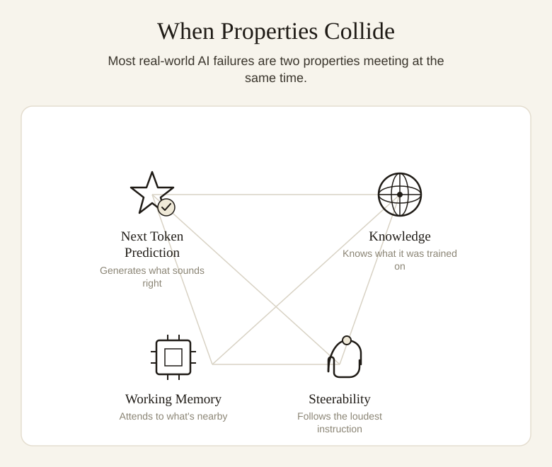

Anthropic Academy — AI Capabilities and Limitations:

https://anthropic.skilljar.com/ai-capabilities-and-limitations — Mentalmodell für KI-Verhalten über
vier Eigenschaften: Next Token Prediction, Knowledge, Working Memory, Steerability. Relevant für uns,
weil Lana beim Traden ("00-trading-steps") regelmäßig Dinge vergisst/übersieht — diese beiden Lessons
treffen das Problem direkt (siehe "Bezug zu unserem Problem" unten).

## Steerability

Lesson: https://anthropic.skilljar.com/ai-capabilities-and-limitations/456457

Das Modell folgt Anweisungen genauso wie allem anderen: durch Musterfortsetzung (Next Token
Prediction), nicht durch Verständnis. Daraus folgt: es gibt IMMER eine Lücke zwischen dem, was
gemeint war, und dem, was ankam — die interessanten Fehler leben in dieser Lücke.

**Capability-Zone** (enge Kontrolle): kurze, konkrete, verifizierbare Anweisungen — Formatvorgaben,
Längenlimits, explizite Rollen.
**Limitation-Zone** (lose Kontrolle): lange Denkketten, abstrakte/mehrdeutige Anweisungen, native
Zahlen-/Logik-Präzision.

**Charakteristische Fehler:**
- **Reasoning Drift** — ein kleiner Fehler früh in einer mehrstufigen Kette pflanzt sich bis zum
  Ende fort (Gegenmittel laut Lesson: Checkpoint einbauen, Zwischenergebnis vor dem Weitermachen
  zeigen lassen).
- **Letter-over-Spirit** — die Anweisung wurde wörtlich befolgt, aber der eigentliche Zweck verfehlt
  (Lesson-Beispiel: "mach's kürzer" auf einen Text, dessen echtes Problem die Struktur ist).
- Brüchige Arithmetik/Logik bei nativer Präzisionsanforderung. **Mögliche Anwendung bei uns:**
  Pip-Distanzen/RR werden aktuell von Lana im Kopf gerechnet (siehe z.B. `trade-analysis.state.md`:
  "Risiko ≈ 8,0 Pips, Reward ≈ 10,2 Pips ---> RR ≈ 1:1,3") — genau diese Fehlerklasse, und
  entscheidet direkt über Trade/Kein-Trade in Schritt 7 (Ausschlusskriterium RR < 1:3). Ein kleines
  deterministisches MCP-Tool (z.B. `calc_rr`, Entry/SL/Target + Instrument rein, Pip-Distanz+RR
  raus) würde das auf eine echte Berechnung statt Modell-Arithmetik umstellen — noch nicht gebaut,
  nur als Idee festgehalten.

**Was dagegen hilft (Produkt-Ebene):** System Prompts, Code-Ausführung, sichtbares Reasoning,
strukturierte Outputs — alles Mechanismen, die verhindern, dass sich die eigentliche Absicht im
Kontext "verdünnt".

**Wichtigste Handlungsregel aus der Lesson:** Wenn eine Anweisung wörtlich, aber nutzlos befolgt
wurde, NICHT dieselbe Anweisung nochmal mit mehr Nachdruck wiederholen — das schließt die Lücke
nicht. Stattdessen das Ziel (nicht nur die Anweisung) neu formulieren.

### Handlungsregeln (eigene Notizen, decken sich mit den Lesson-Takeaways)

1. Das Ziel explizit neben den Schritten nennen, nicht nur das Format.
2. Lange Ketten mit Checkpoints unterbrechen.
3. Bei einer wörtlich-aber-nutzlos befolgten Anweisung das Ziel genauer beschreiben, statt die
   Anweisung nur zu wiederholen.
4. Konkrete, verifizierbare Anweisungen nah an der eigentlichen Aufgabe halten.

→ kürzer und prüfbar statt lang und mehrdeutig.

## When Properties Collide

Lesson: https://anthropic.skilljar.com/ai-capabilities-and-limitations/456459

(Eigene Nachbildung des Lesson-Diagramms als SVG — der Original-Screenshot selbst lässt sich nicht
als Datei übernehmen, nur inhaltlich nachbauen. Original: Copyright 2026 Anthropic, CC BY-NC-SA 4.0,
aufbauend auf dem AI Fluency Framework von Prof. Rick Dakan/Prof. Joseph Feller.)

Kernsatz: *"Most real-world AI failures are two properties meeting at the same time."* — die
meisten Fehler sind kein Versagen einer einzelnen Eigenschaft, sondern das Zusammentreffen zweier
Eigenschaften gleichzeitig. Sobald man benennen kann, WELCHE zwei gerade kollidieren, weiß man auch,
welchen Fix man braucht.

Vier Eigenschaften, ihre Kurzformel aus dem Diagramm:
- **Next Token Prediction** — "Generates what sounds right"
- **Knowledge** — "Knows what it was trained on"
- **Working Memory** — "Attends to what's nearby"
- **Steerability** — "Follows the loudest instruction" (nicht "folgt der korrekten Anweisung",
  sondern der lautesten/nächstliegenden)

**Diagnostische Paare aus der Lesson:**
- **Next Token Prediction + Knowledge → halluzinierte Details** (Fix: *"use a tool with source
  grounding"* — die Antwort aktiv an eine echte externe Quelle binden statt aus dem Modell-Wissen
  zu antworten, statt nur nachträglich zu verifizieren).
- **Working Memory + Steerability → Drift in langen Gesprächen/Sessions** (Fix: Kontext erneut
  zuführen, auf Code-Ausführung/strukturierte Tools auslagern, oder aktiv zurückfragen lassen statt
  stillschweigend weiterlaufen zu lassen).

Die Lesson nennt das Benennen des Paars selbst als **Discernment** angewendet (4D-Framework, siehe
[ai-fluency-4d.md](ai-fluency-4d.md)) — man bewertet einen Output besser, wenn man weiß, welche Art
von Falsch gerade vorliegt, statt nur "das stimmt nicht" zu sagen.

**Exercise "The Failure Diagnosis"** (Kurzfassung): konkrete enttäuschende AI-Outputs aus der
eigenen Erfahrung sammeln, pro Fall die KI selbst fragen "welche der vier Eigenschaften waren hier
wahrscheinlich im Spiel, und warum?", die Diagnose kritisch gegenprüfen (nicht blind übernehmen —
Sykophantie-Gefahr, die KI stimmt der eigenen Rahmung evtl. zu bereitwillig zu), dann erst den
gezielten Fix ableiten.

### Bezug zu unserem Problem: das zweite diagnostische Paar trifft uns direkt

**Working Memory + Steerability → Drift in langen Gesprächen/Sessions** ist praktisch wortgleich
Philips Beobachtung ("Lana beim Traden vergisst oft irgendwas") — kein Zufall, sondern genau das
Paar, das laut Lesson bei langen Sessions typischerweise kollidiert:
- **Working-Memory-Anteil**: ein Fakt ist zwar irgendwo im Kontext, aber nicht mehr "in der Nähe"
  genug, um noch berücksichtigt zu werden. Dagegen ist `trading-runs/[Instrument]/[Datum]/
  trade-analysis.state.md` schon der strukturell richtige Fix (siehe unten) — Fakten extern
  ablegen statt dem Modell-internen Kontext überlassen, von jedem Step explizit als Input gelesen.
- **Steerability-Anteil**: eine der vielen gestapelten Anweisungen (CLAUDE.md, `l.md`, `trading/
  claude-project-instructions.md`, `00-trading-steps/*.md`, Skills) wird nicht befolgt, weil sie in
  dem Moment nicht die "lauteste" ist. Davor schützt die State-Datei NICHT — anderer Mechanismus.
  Deckt sich mit der bereits dokumentierten CLAUDE.md-Regel (trading-monitor wie trading-Repo), dass
  ein Prozessfehler einen strukturellen Fix braucht (Skill, Hook, Doku-Schärfung) statt nur einen
  einmaligen Output-Patch oder Memory-Eintrag — ein Memory-Eintrag macht eine Anweisung nicht
  lauter, sie kann im nächsten vollen Kontext wieder untergehen.

Long-Chain-Aufgaben wie die 8 Trading-Steps sind laut Steerability-Lesson ohnehin in der
Limitation-Zone (lange Denkkette) — Checkpoints (genau das, was die einzelnen Step-Dateien mit ihrem
"Ergebnis persistieren, bevor es weitergeht" schon tun) sind das primäre Gegenmittel.

Praktische Konsequenz aus der Exercise-Methode: bei der nächsten enttäuschenden Lana-Antwort explizit
fragen "welche der vier Eigenschaften waren hier im Spiel" statt nur den Output zu korrigieren — das
lenkt direkt zum passenden Fix (Kontext nachliefern vs. Anweisung schärfen/lauter machen), statt am
Symptom zu patchen.
